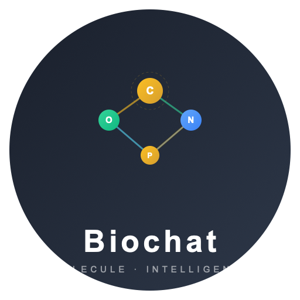
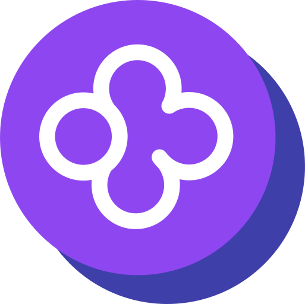
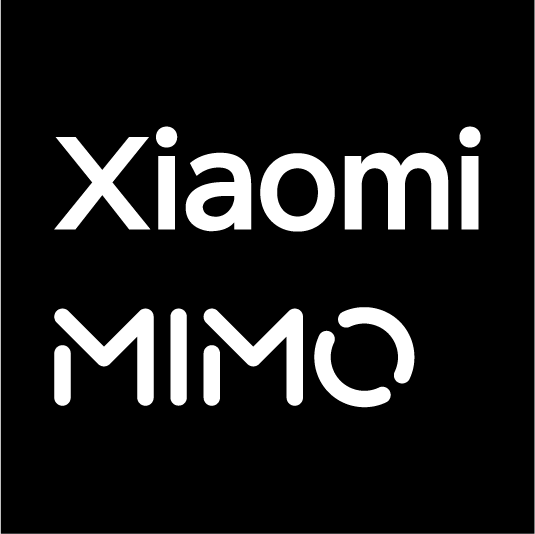

<p align='center'>

</p>

<h1 align="center">DeepChat - 强大的开源多模型 AI Agent 平台</h1>

<p align="center">DeepChat是一个功能丰富的开源 AI Agent 平台，统一模型、工具与 Agent：多模型聊天、MCP 工具调用、Skills、ACP Agent 集成和远程控制。</p>

<p align="center">
  <a href="https://github.com/ThinkInAIXYZ/deepchat/stargazers"></a>
  <a href="https://github.com/ThinkInAIXYZ/deepchat/network/members"></a>
  <a href="https://github.com/ThinkInAIXYZ/deepchat/pulls"></a>
  <a href="https://github.com/ThinkInAIXYZ/deepchat/issues"></a>
  <a href="https://github.com/ThinkInAIXYZ/deepchat/blob/main/LICENSE"></a>
  <a href="https://github.com/ThinkInAIXYZ/deepchat/releases/latest"></a>
  <a href="https://deepwiki.com/ThinkInAIXYZ/deepchat"></a>
</p>

<div align="center">
  <a href="https://trendshift.io/repositories/15162" target="_blank"></a>
</div>

<div align="center">
  <a href="./README.zh.md">中文</a> / <a href="./README.md">English</a> / <a href="./README.jp.md">日本語</a>
</div>

## 📑 目录

- [📑 目录](#-目录)
- [🚀 项目简介](#-项目简介)
- [💡 为什么选择DeepChat](#-为什么选择deepchat)
- [🔥 主要功能](#-主要功能)
- [🧠 Skills 支持](#-skills-支持)
- [🧩 ACP 集成（Agent Client Protocol）](#-acp-集成agent-client-protocol)
- [📡 远程控制](#-远程控制)
- [🤖 支持的模型提供商](#-支持的模型提供商)
  - [兼容任何OpenAI/Gemini/Anthropic API格式的模型提供商](#兼容任何openaigeminianthropic-api格式的模型提供商)
- [🔍 使用场景](#-使用场景)
- [📦 快速开始](#-快速开始)
  - [下载安装](#下载安装)
  - [配置模型](#配置模型)
  - [开始对话](#开始对话)
- [💻 开发指南](#-开发指南)
  - [安装依赖](#安装依赖)
  - [开始开发](#开始开发)
  - [构建](#构建)
- [👥 社区与贡献](#-社区与贡献)
- [⭐ Star历史](#-star历史)
- [👨‍💻 贡献者](#-贡献者)
- [📃 许可证](#-许可证)

## 🚀 项目简介

DeepChat是一个功能强大的开源 AI Agent 平台，将模型、工具与 Agent Runtime 统一在一款桌面应用中。无论是云端API如OpenAI、Gemini、Anthropic，还是本地部署的Ollama模型，DeepChat都能提供流畅的用户体验。

除了聊天，DeepChat还支持更强的 agentic 工作流：通过 MCP（Model Context Protocol）进行工具调用，通过可安装的 Skills强化专门任务，并内置 ACP（Agent Client Protocol）集成，让 ACP 兼容 Agent 以一等“模型”形态接入，同时提供专用 Workspace UI，也支持从聊天软件远程控制会话。

<table align="center">
  <tr>
    <td align="center" style="padding: 10px;">
      
      <br/>
    </td>
    <td align="center" style="padding: 10px;">
      
      <br/>
    </td>
  </tr>
</table>

## 💡 为什么选择DeepChat

与其他AI工具相比，DeepChat具有以下独特优势：

- **多模型统一管理**：一个应用支持几乎所有主流LLM，无需在多个应用间切换
- **本地模型无缝集成**：内置Ollama支持，无需命令行操作即可管理和使用本地模型
- **Agentic 协议生态**：内置MCP支持工具调用（代码执行、网络访问等），Skills 提供可复用的任务专长，同时内置ACP支持将外部 Agent 接入 DeepChat，并提供原生 Workspace 体验
- **强大的搜索增强**：支持多种搜索引擎，让AI回答更加准确和及时，提供了非标网页搜索范式，可以快速定制
- **远程工作流**：支持通过 Telegram、飞书/Lark、QQBot、Discord 和微信 iLink 控制 DeepChat 会话
- **注重隐私保护**：本地数据存储，支持网络代理，减少信息泄露风险
- **开源友好**：基于 Apache License 2.0 协议，适合商业和个人使用

## 🔥 主要功能

- 🌐 **多种云端LLM提供商支持**：DeepSeek、OpenAI、Moonshot/Kimi、Grok、Gemini、Anthropic等
- 🏠 **本地模型部署支持**：
  - 集成Ollama，提供全面的管理功能
  - 无需命令行操作即可控制和管理Ollama模型的下载、部署和运行
- 🚀 **丰富易用的聊天功能**
  - 完整的Markdown渲染，代码块渲染基于业界顶级的 [CodeMirror](https://codemirror.net/) 实现
  - 多窗口+多Tab架构，各个维度支持多会话并行运行，就像使用浏览器一样使用大模型，无阻塞的体验带来了优异的效率
  - 支持 Artifacts 渲染，多样化结果展示，MCP集成后显著节省token消耗
  - 消息支持重试生成多个变体；对话可自由分支，确保总有合适的思路
  - 支持渲染图像、Mermaid图表等多模态内容；支持GPT-4o,Gemini,Grok的文本到图像功能
  - 支持在内容中高亮显示搜索结果等外部信息源
- 🔍 **强大的搜索扩展能力**
  - 通过MCP模式内置集成博查搜索、Brave Search等 领先搜索API，让模型智能决定何时搜索
  - 通过模拟用户网页浏览，支持Google、Bing、百度、搜狗公众号搜索等主流搜索引擎，使LLM能像人类一样阅读搜索引擎
  - 支持读取任何搜索引擎；只需配置搜索助手模型，即可连接各种搜索源，无论是内部网络、无API的引擎，还是垂直领域搜索引擎，作为模型的信息源
- 🔧 **出色的MCP（Model Context Protocol）支持**
  - 完整支持了 MCP 协议中 Resources/Prompts/Tools 三大核心能力
  - 支持语义工作流，通过理解任务的意义和上下文，实现更复杂和智能的自动化
  - 极其用户友好的配置界面
  - 美观清晰的工具调用显示
  - 详细的工具调用调试窗口，自动格式化工具参数和返回数据
  - 内置 Node.js 运行环境；类似 npx/node 的服务无需额外配置开箱即用
  - 支持 StreamableHTTP/SSE/Stdio 协议 Transports
  - 支持 inMemory 服务，内置代码执行、网络信息获取、文件操作等实用工具；开箱即用，无需二次安装即可满足大多数常见用例
  - 通过内置 MCP 服务，将视觉模型能力转换为任何模型都可通用的函数
- 🧠 **Skills**
  - 支持从文件夹、ZIP 文件或 URL 安装 Skills
  - 可按会话启用 Skills，让 DeepChat 加载任务专用说明、参考资料和可选脚本
  - 支持与其他 AI 编程助手导入/导出 Skills
  - 内置 Skills 覆盖代码审查、文档协作、Office/PDF 处理、前端设计、MCP 开发等任务
- 🤝 **ACP（Agent Client Protocol）Agent 集成**
  - 将 ACP 兼容 Agent（内置或自定义命令）作为可选“模型”使用
  - Agent 提供时，支持 ACP Workspace UI 展示结构化计划、工具调用与终端输出
- 📡 **远程控制**
  - 支持通过 Telegram、飞书/Lark、QQBot、Discord 和微信 iLink 控制 DeepChat 会话
  - 可将远程端点绑定到会话，并从聊天软件中管理对话
  - 支持远程新建或切换会话、停止生成、打开桌面会话、处理待确认交互、切换模型和查看状态
- 💻 **多平台支持**：Windows、macOS、Linux
- 🎨 **美观友好的界面**，以用户为中心的设计，精心设计的明暗主题
- 🔗 **丰富的DeepLink支持**：通过链接发起对话，与其他应用无缝集成。还支持一键安装MCP服务，简单快速
- 🚑 **安全优先设计**：聊天数据和配置数据预留加密接口和代码混淆能力
- 🛡️ **隐私保护**：支持屏幕投影隐藏、网络代理等隐私保护方法，降低信息泄露风险
- 💰 **商业友好**：
  - 拥抱开源，基于 Apache License 2.0 协议，企业使用安心无忧
  - 企业集成只需要修改极少配置代码即可使用预留的加密混淆的安全能力
  - 代码结构清晰，无论是模型供应商还是 MCP 服务都高度解耦，可以随意进行增删定制，成本极低
  - 架构合理，数据交互和UI行为分离，充分利用 Electron 的能力，拒绝简单的网页套壳，性能优异

## 🧠 Skills 支持

DeepChat Skills 是兼容标准 Agent Skills 规范的设计。一个 Skill 可以包含任务说明、参考资料、素材和可选脚本，让 DeepChat 在启用后更像某个领域的专门助手。

你可以从文件夹、ZIP 文件或 URL 安装 Skills，也可以与 Claude Code、Codex、Cursor、Windsurf、GitHub Copilot、Kiro、Antigravity、OpenCode、Goose、Kilo Code 等兼容工具导入/导出。

内置 Skills 覆盖算法艺术、代码审查、DeepChat 设置、文档协作、DOCX、前端设计、git commit 信息、信息图语法、MCP 构建、PDF、PPTX、Skill 创建、Web Artifacts 和 XLSX 工作流。

快速上手：

1. 打开 **设置 → Skills**
2. 安装或导入一个 Skill
3. 在需要对应能力的会话中启用它

## 🧩 ACP 集成（Agent Client Protocol）

DeepChat内置对 [Agent Client Protocol（ACP）](https://agentclientprotocol.com) 的支持，让你可以把外部 Agent Runtime 以原生体验接入 DeepChat。启用后，ACP Agent 会作为一等“模型”出现在模型选择器中，你可以直接在 DeepChat 内使用编码/任务类 Agent，并配合 Workspace UI 进行交互。

快速上手：

1. 打开 **设置 → ACP Agent** 并开启 ACP
2. 启用一个内置 ACP Agent，或添加自定义 ACP 兼容命令
3. 在模型选择器中选择该 ACP Agent，开始一个 Agent 会话

ACP 生态中更多兼容 Agent/Client 参考：https://agentclientprotocol.com/overview/clients

## 📡 远程控制

DeepChat 可以通过聊天软件远程控制，让你离开桌面后也能继续使用同一个会话。配置入口在 **设置 → Remote**。

当前支持 Telegram、飞书/Lark、QQBot、Discord 和微信 iLink。远程端点可以绑定到一个 DeepChat 会话，然后在远程聊天中创建新会话、列出和切换最近会话、停止生成、在桌面打开当前会话、回答待确认问题或权限请求、切换模型并查看运行状态。

常用命令包括 `/start`、`/help`、`/pair`、`/new`、`/sessions`、`/use`、`/stop`、`/open`、`/pending`、`/model` 和 `/status`。

## 🤖 支持的模型提供商

<table>
  <tr align="center">
    <td>
      <br/>
      <a href="https://deepseek.com/">Deepseek</a>
    </td>
    <td>
      <br/>
      <a href="https://moonshot.ai/">Moonshot</a>
    </td>
    <td>
      <br/>
      <a href="https://openai.com/">OpenAI</a>
    </td>
    <td>
      <br/>
      <a href="https://gemini.google.com/">Gemini</a>
    </td>
  </tr>
  <tr align="center">
    <td>
      <br/>
      <a href="https://ollama.com/">Ollama</a>
    </td>
    <td>
      <br/>
      <a href="https://www.qiniu.com">Qiniu</a>
    </td>
    <td>
      <br/>
      <a href="https://www.newapi.ai/">New API</a>
    </td>
    <td>
      <br/>
      <a href="https://x.ai/">Grok</a>
    </td>
  </tr>
  <tr align="center">
    <td>
      <br/>
      <a href="https://open.bigmodel.cn/">Zhipu</a>
    </td>
    <td>
      <br/>
      <a href="https://ppinfra.com/">PPIO</a>
    </td>
    <td>
      <br/>
      <a href="https://platform.minimaxi.com/">MiniMax</a>
    </td>
    <td>
      <br/>
      <a href="https://fireworks.ai/">Fireworks</a>
    </td>
  </tr>
  <tr align="center">
    <td>
      <br/>
      <a href="https://aihubmix.com/">AIHubMix</a>
    </td>
    <td>
      <br/>
      <a href="https://console.volcengine.com/ark/">Doubao</a>
    </td>
    <td>
      <br/>
      <a href="https://www.aliyun.com/product/bailian">DashScope</a>
    </td>
    <td>
      <br/>
      <a href="https://groq.com/">Groq</a>
    </td>
  </tr>
  <tr align="center">
    <td>
      <br/>
      <a href="https://jiekou.ai?utm_source=github_deepchat">JieKou.AI</a>
    </td>
    <td>
      <br/>
      <a href="https://zenmux.ai/">ZenMux</a>
    </td>
    <td>
      <br/>
      <a href="https://github.com/marketplace/models">GitHub Models</a>
    </td>
    <td>
      <br/>
      <a href="https://lmstudio.ai/docs/app">LM Studio</a>
    </td>
  </tr>
  <tr align="center">
    <td>
      <br/>
      <a href="https://cloud.tencent.com/product/hunyuan">Hunyuan</a>
    </td>
    <td>
      <br/>
      <a href="https://302.ai">302.AI</a>
    </td>
    <td>
      <br/>
      <a href="https://www.together.ai/">Together</a>
    </td>
    <td>
      <br/>
      <a href="https://poe.com/">Poe</a>
    </td>
  </tr>
  <tr align="center">
    <td>
      <br/>
      <a href="https://vercel.com/ai">Vercel AI Gateway</a>
    </td>
    <td>
      <br/>
      <a href="https://openrouter.ai/">OpenRouter</a>
    </td>
    <td>
      <br/>
      <a href="https://azure.microsoft.com/en-us/products/ai-services/openai-service">Azure OpenAI</a>
    </td>
    <td>
      <br/>
      <a href="https://tokenflux.ai/">TokenFlux</a>
    </td>
  </tr>
  <tr align="center">
    <td>
      <br/>
      <a href="https://www.burncloud.com/">BurnCloud</a>
    </td>
    <td>
      <br/>
      <a href="https://openai.com/">OpenAI Responses</a>
    </td>
    <td>
      <br/>
      <a href="https://open.cherryin.ai/console">CherryIn</a>
    </td>
    <td>
      <br/>
      <a href="https://modelscope.cn/">ModelScope</a>
    </td>
  </tr>
  <tr align="center">
    <td>
      <br/>
      <a href="https://aws.amazon.com/bedrock/">AWS Bedrock</a>
    </td>
    <td>
      <br/>
      <a href="https://voice.ai/">Voice.ai</a>
    </td>
    <td>
      <br/>
      <a href="https://cloud.google.com/vertex-ai">Vertex AI</a>
    </td>
    <td>
      <br/>
      <a href="https://github.com/features/copilot">GitHub Copilot</a>
    </td>
  </tr>
  <tr align="center">
    <td>
      <br/>
      <a href="https://platform.xiaomimimo.com/#/docs/quick-start/first-api-call">Xiaomi</a>
    </td>
    <td>
      <br/>
      <a href="https://o3.fan">o3.fan</a>
    </td>
    <td>
      <br/>
      <a href="https://novita.ai/">Novita AI</a>
    </td>
    <td>
      <br/>
      <a href="https://astraflow.ucloud.cn/">Astraflow</a>
    </td>
  </tr>
  <tr align="center">
    <td>
      <br/>
      <a href="https://www.anthropic.com/">Anthropic</a>
    </td>
    <td>
      <br/>
      <a href="https://www.siliconflow.cn/">SiliconFlow</a>
    </td>
  </tr>

</table>

### 兼容任何OpenAI/Gemini/Anthropic API格式的模型提供商

## 🔍 使用场景

DeepChat适用于多种AI应用场景：

- **日常助手**：回答问题、提供建议、辅助写作和创作
- **开发辅助**：代码生成、调试、技术问题解答
- **学习工具**：概念解释、知识探索、学习辅导
- **内容创作**：文案撰写、创意激发、内容优化
- **数据分析**：数据解读、图表生成、报告撰写

## 📦 快速开始

### 下载安装

您可以通过以下任一方式安装 DeepChat：

**方式一：GitHub Releases**

从[GitHub Releases](https://github.com/ThinkInAIXYZ/deepchat/releases)页面下载适合您系统的最新版本：

- Windows: `.exe`安装文件
- macOS: `.dmg`安装文件
- Linux: `.AppImage`或`.deb`安装文件

**方式二：官网下载**

从[官网下载页面](https://deepchatai.cn/#/download)获取安装包。

**方式三：Homebrew（仅 macOS）**

macOS 用户可以使用 Homebrew 安装：

```bash
brew install --cask deepchat
```

### 配置模型

1. 启动DeepChat应用
2. 点击设置图标
3. 选择"模型提供商"选项卡
4. 添加您的API密钥或配置本地Ollama

### 开始对话

1. 点击"+"按钮创建新对话
2. 选择您想使用的模型
3. 开始与AI助手交流

## 💻 开发指南

请阅读[贡献指南](./CONTRIBUTING.md)

Windows和Linux通过GitHub Action打包。
对于Mac相关的签名和打包，请参考[Mac发布指南](https://github.com/ThinkInAIXYZ/deepchat/wiki/Mac-Release-Guide)。

### 安装依赖

```bash
$ pnpm install
$ pnpm run installRuntime
# 如果出现错误：No module named 'distutils'
$ pip install setuptools
```

* For Windows: 为允许非管理员用户创建符号链接和硬链接，请在设置中开启``开发者模式``或使用管理员账号，否则 ``pnpm`` 操作将失败。

### 开始开发

```bash
$ pnpm run dev
```

### 构建

```bash
# Windows
$ pnpm run build:win

# macOS
$ pnpm run build:mac

# Linux
$ pnpm run build:linux

# 指定架构打包
$ pnpm run build:win:x64
$ pnpm run build:win:arm64
$ pnpm run build:mac:x64
$ pnpm run build:mac:arm64
$ pnpm run build:linux:x64
$ pnpm run build:linux:arm64
```

## 👥 社区与贡献

DeepChat是一个活跃的开源社区项目，我们欢迎各种形式的贡献：

- 🐛 [报告问题](https://github.com/ThinkInAIXYZ/deepchat/issues)
- 💡 [提交功能建议](https://github.com/ThinkInAIXYZ/deepchat/issues)
- 🔧 [提交代码改进](https://github.com/ThinkInAIXYZ/deepchat/pulls)
- 📚 [完善文档](https://github.com/ThinkInAIXYZ/deepchat/wiki)
- 🌍 [帮助翻译](https://github.com/ThinkInAIXYZ/deepchat/tree/main/locales)

查看[贡献指南](./CONTRIBUTING.md)了解更多参与项目的方式。

## ⭐ Star历史

[](https://www.star-history.com/#ThinkInAIXYZ/deepchat&Timeline)

## 👨‍💻 贡献者

感谢您考虑为deepchat做出贡献！贡献指南可以在[贡献指南](./CONTRIBUTING.md)中找到。

<a href="https://openomy.com/thinkinaixyz/deepchat" target="_blank" style="display: block; width: 100%;" align="center">
  
</a>

## 🙏🏻 致谢

本项目的构建得益于这些优秀的开源库：

- [Vue](https://vuejs.org/)
- [Electron](https://www.electronjs.org/)
- [Electron-Vite](https://electron-vite.org/)
- [oxlint](https://github.com/oxc-project/oxc)

## 📃 许可证

[LICENSE](./LICENSE)
