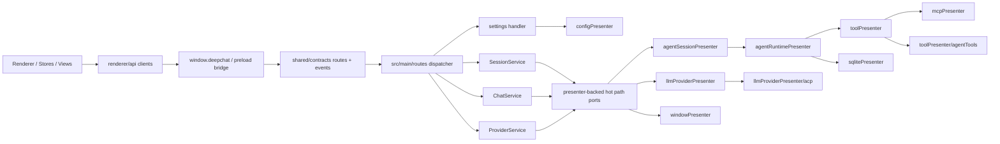

# DeepChat 当前架构概览

本文档描述 `2026-04-20` 完成 main kernel refactor phase5 收口后的主架构。

## 主链路

主结论：

- migrated renderer boundary 先经过 `renderer/api`、`window.deepchat` 和 shared contracts，再进入 main。
- `src/main/routes/index.ts` 是 settings / sessions / chat / providers 这些 migrated path 的 typed dispatcher 和装配入口。
- 现有 presenter 仍然存在，但主要通过 `hotPathPorts` / `runtimePorts` 这样的窄 port 暴露给 route services。
- `SessionPresenter` 继续保留为 legacy 数据平面和导出边界，不再是 migrated chat hot path 的 owner。

## 模块职责

| 模块 | 位置 | 职责 |
| --- | --- | --- |
| `renderer/api` | `src/renderer/api/` | 为 settings / sessions / chat / providers 提供 typed renderer client |
| shared contracts | `src/shared/contracts/` | 维护 route registry、schema、typed event catalog |
| preload bridge | `src/preload/createBridge.ts` / `src/preload/index.ts` | 统一暴露 `window.deepchat.invoke/on` |
| main route runtime | `src/main/routes/` | typed route dispatch、settings handler、session/chat/provider services |
| presenter-backed ports | `src/main/routes/hotPathPorts.ts` / `src/main/presenter/runtimePorts.ts` | 把现有 presenter 收敛成 route service 可依赖的窄接口 |
| `AgentSessionPresenter` | `src/main/presenter/agentSessionPresenter/` | session registry、window binding、legacy import、runtime delegation |
| `AgentRuntimePresenter` | `src/main/presenter/agentRuntimePresenter/` | 聊天 runtime、stream loop、tool interaction、message persistence |
| `ToolPresenter` | `src/main/presenter/toolPresenter/` | 工具定义聚合、调用路由、权限预检查 |
| `LLMProviderPresenter` | `src/main/presenter/llmProviderPresenter/` | provider 实例、stream state、model 管理、ACP provider helper |
| `SessionPresenter` | `src/main/presenter/sessionPresenter/` | legacy 会话数据访问、导出、历史兼容边界 |

## 当前分层

### 1. Renderer-main boundary

- `src/shared/contracts/routes*.ts` 与 `events*.ts` 是 migrated path 的唯一契约真源。
- `src/preload/createBridge.ts` 负责把 route invoke 和 typed event subscribe 统一暴露到 `window.deepchat`。
- `src/renderer/api/*Client.ts` 吸收 bridge 细节，组件和 store 不直接拼新的 raw channel 字符串。

### 2. Main route runtime

- `src/main/routes/index.ts` 根据 route registry 分发请求。
- settings 走 `settings handler + adapter`。
- sessions、chat、providers 分别走 `SessionService`、`ChatService`、`ProviderService`。
- `Scheduler` 统一承接 migrated chat path 上的 timeout、retry、cancel 语义。

### 3. Presenter-backed runtime

- `createPresenterHotPathPorts()` 把 `agentSessionPresenter`、`configPresenter`、`llmProviderPresenter` 收敛成 route service 依赖的最小 port。
- `AgentSessionPresenter` 仍持有 session registry、window 绑定和 legacy import helper。
- `AgentRuntimePresenter` 继续拥有消息主循环、工具暂停恢复、消息持久化和增量 stream echo。
- `ToolPresenter`、`LLMProviderPresenter` 和 `mcpPresenter` 继续服务未迁移能力与 runtime 内部协作。

### 4. Compatibility boundary

仍然保留但已降级为兼容职责的边界：

- `src/main/presenter/agentSessionPresenter/legacyImportService.ts`
- 旧 `conversations/messages` 数据域，作为 import-only 与导出数据源
- `src/main/presenter/sessionPresenter/`，作为 main 内部 compatibility/data facade
- `src/main/eventbus.ts`，继续服务未迁移路径，但 migrated UI 通知优先走 typed events

## Phase 5 结论

- 本轮已经完成“边界稳定化 + 热路径减耦 + 可测试性提升”的目标。
- 当前不继续发起一次性全量 `main kernel` rewrite。
- 后续只在出现新的明确 hot path 收益时，再继续做 slice-driven typed-boundary migration。

## Post-P5 执行规则

`phase5` 收口不等于 renderer-main 已经完成单轨化。

当前后续工作的默认规则是：

- renderer 新功能优先走 `renderer/api/*Client` + `window.deepchat` + shared contracts
- `useLegacyPresenter()`、`window.electron`、`window.api` 只视为兼容路径，不再作为业务层默认入口
- `src/renderer/api/legacy/presenters.ts` 已退役，剩余 quarantine-only 入口固定为
  `src/renderer/api/legacy/presenters.ts`
- renderer 业务模块不应再混用 typed client 与 legacy transport
- renderer legacy quarantine 目录固定为 `src/renderer/api/legacy/**`，不再允许创建第二个 quarantine 路径

单轨化的目标、阶段和 merge gate 见：

- [specs/renderer-main-single-track/spec.md](./specs/renderer-main-single-track/spec.md)
- [specs/renderer-main-single-track/plan.md](./specs/renderer-main-single-track/plan.md)
- [specs/renderer-main-single-track/tasks.md](./specs/renderer-main-single-track/tasks.md)

## 历史对照与防回归

- 历史架构文档见 [archives/legacy-agentpresenter-architecture.md](./archives/legacy-agentpresenter-architecture.md)
- 历史流程文档见 [archives/legacy-agentpresenter-flows.md](./archives/legacy-agentpresenter-flows.md)
- main kernel 边界回归由 `scripts/architecture-guard.mjs` 和 `docs/architecture/baselines/main-kernel-*.{md,json}` 追踪
- `scripts/architecture-guard.mjs` 负责固定 `src/renderer/api/legacy/**`、禁止业务层新增 direct legacy transport，并把 typed boundary 外的 legacy access 视为违规
- legacy agent cleanup 回归由 `scripts/agent-cleanup-guard.mjs` 追踪
- renderer-main 单轨化后续治理由 `docs/specs/renderer-main-single-track/` 追踪

## 推荐阅读顺序

1. [README.md](./README.md)
2. [guides/code-navigation.md](./guides/code-navigation.md)
3. [FLOWS.md](./FLOWS.md)
4. [architecture/agent-system.md](./architecture/agent-system.md)
5. [architecture/tool-system.md](./architecture/tool-system.md)
6. [architecture/session-management.md](./architecture/session-management.md)

