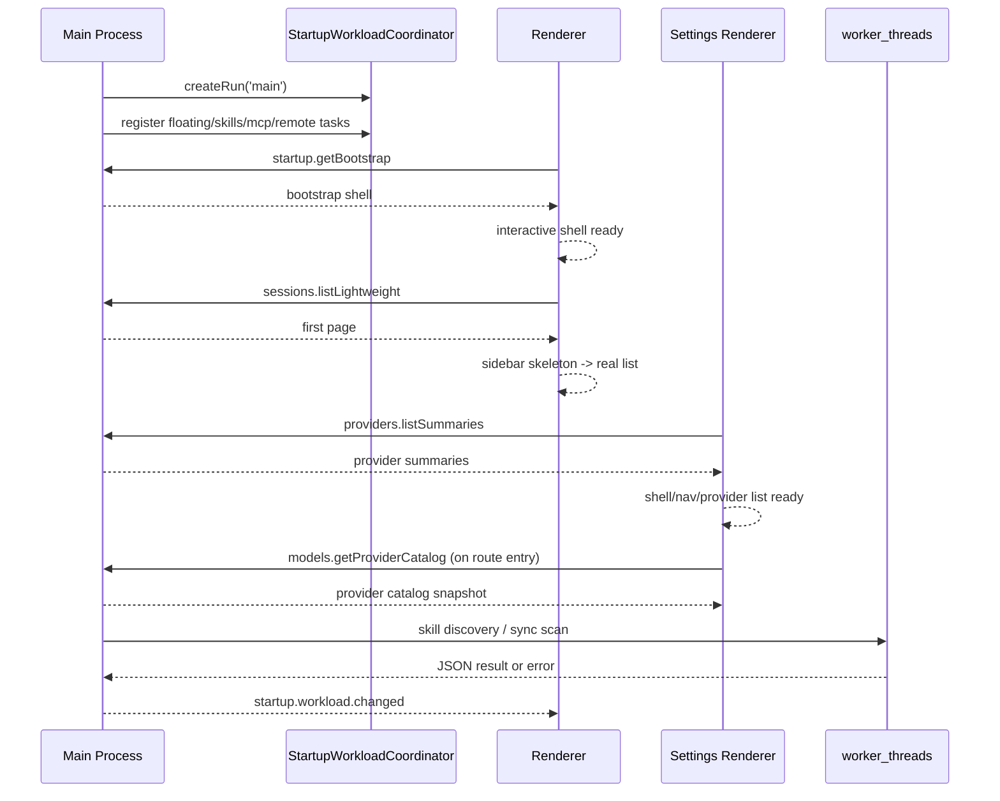

# Startup Orchestration 实施计划

## 规划结论

本轮实现拆成两阶段推进，但都沿用同一套 `startup-orchestration` 规格，不再另起一套启动方案：

1. phase 1：coordinator、typed event、summary route、on-demand hydration、chunked main tasks
2. phase 2：skills discover / sync scan worker 化，补齐 main-side 热点优化

当前分支的交付目标是：

```text
main: 先可交互，再渐进补
settings: summary first，再分 section hydration
background: coordinator 调度
cpu parse/scan: off-main
```

## 当前实现架构



## Phase 1

### 1. Coordinator 与 workload contract

落地项：

1. `StartupWorkloadCoordinator`
2. `startup.workload.changed`
3. shared task id / phase / state schema
4. settings target cancel / replay

结果：

1. startup task 不再是松散 fire-and-forget
2. renderer 可以按 target/task 感知 readiness
3. settings 关闭后后台 warmup 不再继续偷偷跑

### 2. Route-level startup tracking

落地项：

1. `startup.getBootstrap` -> `main.bootstrap`
2. `sessions.listLightweight` -> `main.session.firstPage`
3. `providers.listSummaries` -> `settings.providers.summary`
4. `models.getProviderCatalog` -> `settings.provider.models` / `main.provider.warmup`
5. Ollama / skills / MCP route tracking

结果：

1. route 级 workload 可观测
2. 主要 settings section readiness 有统一事件源

### 3. Settings staged hydration

落地项：

1. settings 首屏只跑 cheap snapshot + provider summaries
2. `modelStore.initialize()` / `ollamaStore.initialize()` 退出 settings-open 默认链路
3. provider detail / skills / MCP / remote 页面按路由进入后再 hydration
4. heavy settings section 统一给 skeleton

结果：

1. settings 打开不再整窗拉满
2. heavy 页面 ready 前有明确占位态

### 4. Main window warmup policy

落地项：

1. 去掉主窗口 interactive 后立即全量 provider/model warmup
2. `ChatStatusBar` / `NewThreadPage` 改为 likely-provider on-demand warmup
3. coordinator idle 后增加低优先级 provider snapshot backfill

结果：

1. provider/model 数据只在需要时优先补齐
2. 用户不操作相关 UI 时，不再立刻扫全量 provider
3. 空闲窗口下可以渐进预热缓存

### 5. Model status / provider catalog hotspot 修复

落地项：

1. `providers.listSummaries`
2. `models.getProviderCatalog` memory-snapshot-first
3. `ModelStatusHelper` persisted snapshot

结果：

1. settings 首屏不再携带大模型数组
2. route 重复命中时优先走内存而不是反复持久层读取

## Phase 2

### 1. Skill discovery worker

落地项：

1. `runInlineJsonWorker`
2. `discoverSkillMetadataInWorker(...)`
3. worker warning logging
4. worker failure fallback 到旧主线程路径

结果：

1. skill manifest discover / parse 脱离 main
2. 仍保持错误可回退

### 2. Skill sync worker

落地项：

1. `scanExternalToolsInWorker(...)`
2. `scanAndDetectDiscoveriesInWorker(...)`
3. `SkillSyncPresenter` worker-first / main-thread fallback

结果：

1. external tool scan / compare 脱离 main
2. settings skills section 与后台扫描不再直接占用 main CPU

## Worker 边界决策

本轮明确采用：

1. `worker_threads` 处理短生命周期、纯 Node/FS/parse 的 CPU/scan 工作
2. main 保留 Electron 绑定任务的调度与事件桥接

不在本轮切换为 `utilityProcess` 的原因：

1. 当前技能 discover / sync scan 更像短任务，不需要独立进程生命周期管理
2. 现有 `electron-vite + electron-builder + asar` 对当前 inline worker 路径已经可验证打包通过
3. 更适合 `utilityProcess` 的是长驻、隔离性要求更强、失败域更大的 runtime/service 类任务

## 风险与缓解

### 风险 1：idle warmup 又变成新的隐性阻塞

缓解：

1. idle warmup 只在 coordinator idle 后触发
2. 每个 provider 之间显式 yield
3. 仍使用 background phase

### 风险 2：worker 在打包后找不到依赖

缓解：

1. worker 采用 inline eval 模式，避免额外 worker 入口文件打包问题
2. 通过 `createRequire(...)` 把 worker 的依赖解析锚到 bundle 路径，而不是 `process.cwd()`

### 风险 3：settings 关闭后任务残留

缓解：

1. settings workload 全部归属 `target = settings`
2. window close 时统一 `cancelTarget('settings')`

## 验证策略

主进程：

1. coordinator 优先级 / 并发限制 / 取消
2. provider summaries route
3. model status snapshot
4. worker success / fallback

renderer：

1. settings open 仅 cheap init + summaries
2. main window 不再 eager provider warmup
3. heavy settings section skeleton

打包：

1. `electron-vite build`
2. `electron-builder --dir`
3. worker 路径在 asar 环境下可解析依赖

## 后续 follow-up

以下不再算本轮 blocker，但适合作为下一轮：

1. 更细粒度的 main/splash unified trace
2. `utilityProcess` 在 long-lived runtime 任务上的替换评估
3. 更强的 renderer route-level skeleton 自动化测试覆盖
